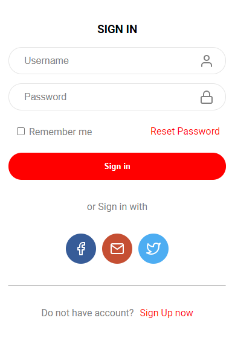

<!-- ************************************* Imagem ********************************************* -->
<div align="center">
  
</div>

<!-- ************************************* Título ********************************************* -->

# Sign in Form

Um simples formúlario desenvolvidos com ténicas de boas práticas para aperfeiçoar minhas habilidades em front-end.

## 🚀 Começando

Necessário apenas realizar o donwload ou baixar uma cópia do projeto para você testar, utilizar ou alterar em sua própria máquina.

### 📋 Pré-requisitos

Um editor de textos caso seja necessário realizar alguma modificação e uma navegador para rodar.

```
Visual Studio Code
Sublime Text
```

### 🔧 Instalação

Realizar o donwload do arquivo ZIP ou criar um clone com o link fornecido.

## 🛠️ Construído com

- HTML 5
- CSS 3

## 🎁 Agradecimentos

- Agradeço sempre aos meus pais pelo apoio incodicional aos estudos 👪
- A minha namorada que sempre me motiva com meus sonhos 👩‍❤️‍💋‍👨
- E agradeço muito aos meus amigos queridos 🕺
- São nessas pessoas que sempre penso ao realizar qualquer projeto, sem eles eu não seria nada.

---

⌨️ com ❤️ por [Igor Macêdo](https://github.com/igormacedo97) 😊
